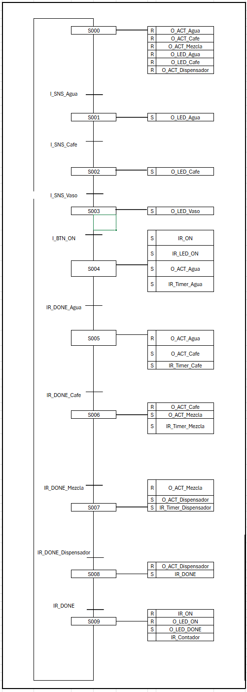

# Parcial #2 - Automatización y Control de Procesos

## Integrantes 

Tomas Candelo Montoya

Juan José Cifuentes Cuellar

Ivan Alejandro Gutierrez 

Melissa Perez Patiño

**** 

# Contexto

Para este Examen Parcial #2 de la asignatura Automatización y Control de Procesos, se nos asignó el diseño de un sistema automatizado para la preparación de una taza de café de 6 oz.

Este diseño debe ser realizado en lenguaje Ladder e implementado a través de OpenPLC en una maqueta funcional que incluya sensores y actuadores reales.

Especificaciones del Sistema

Para la implementación, se consideraron los siguientes puntos: • Inicio del proceso: El sistema debe activarse mediante un interruptor. 
- Preparación de la mezcla: La máquina debe verter automáticamente el café molido y el agua caliente en el recipiente de mezcla. 
- Activación del actuador de mezcla: Se debe activar durante un minuto después de haber recibido el agua y el café por separado. 
- Dispensado del café: Una vez completada la mezcla, el café listo se vierte en un vaso. 
- Finalización y conteo: Al terminar de servir el café, la máquina se apaga y el contador de vasos preparados aumenta en uno.

En este documento, se detallará el proceso de ideación, diseño e implementación de nuestra solución para la máquina de café.

# Diseño del circuito lógico para el proceso automatizado 

## Diseño Lógico 
Para el diseño lógico de la solución lo primero que se hizo fue la definición de las posibles variables necesarias a implementar para posteriormente implementarlas en un diagrama secuencial. En total se realizaron 2 definiciones de variables, la inicial sirvió para definir los requerimientos mínimos que tendría nuestro proyecto, para poder pasar a CODESYS y verificar si este primer borrador de variables cumpliese con el funcionamiento. 

Una vez se implemento en CODESYS a cusa de que hacían falta variables necesarias para la implementación de la solución se realizo una actualización de esta lista de variables con todas las variables que ya se tenían y las que tuvieron que ser creadas, tanto para el funcionamiento real de la solución, como para la simulación que posteriormente seria realizada en CODESYS a través de un HMI. 

La lista de variables final que se utilizaron en nuestra solución fueron las siguientes:

| Nombre               | Atributo      | Tipo   | Comentario                                                    |
|----------------------|--------------|--------|----------------------------------------------------------------|
| I_SNS_Agua          | [Input]       | BOOL   | Sensor que mide que el tanque de agua no está vacío          |
| I_SNS_Cafe          | [Input]       | BOOL   | Sensor que mide que el tanque de café no está vacío          |
| I_SNS_Vaso          | [Input]       | BOOL   | Sensor que mide que hay un vaso puesto en la máquina         |
| I_BTN_ON           | [Input]       | BOOL   | Botón que permite iniciar el proceso de dispensar café      |
| I_BTN_STOP         | [Input]       | BOOL   | Botón que detiene el proceso de dispensar café              |
| O_ACT_AGUA         | [Output]      | BOOL   | Válvula que permite el paso del agua al tanque mezclador    |
| O_ACT_Cafe         | [Output]      | BOOL   | Válvula que permite el paso del café al tanque mezclador    |
| O_ACT_Mezcla       | [Output]      | BOOL   | Válvula que mezcla los contenidos del tanque mezclador      |
| O_ACT_Dispensador  | [Output]      | BOOL   | Válvula que permite el paso de la mezcla al vaso            |
| O_DISP_Contador    | [Output]      | INT    | Contador que indica el número de vasos dispensados al día   |
| O_LED_Agua        | [Output]      | BOOL   | Led que indica la presencia de agua en el tanque mezclador  |
| O_LED_Cafe        | [Output]      | BOOL   | Led que indica la presencia de café en el tanque mezclador  |
| O_LED_Vaso        | [Output]      | BOOL   | Led que indica que el vaso está en su lugar                |
| O_LED_ON          | [Output]      | BOOL   | Led que indica que la máquina está encendida               |
| O_LED_DONE        | [Output]      | BOOL   | Led que indica que el proceso terminó                      |
| TON_Mezcla        | [T_On]        | TON    | Timer que mide el minuto especificado de mezcla            |
| TON_Agua          | [T_On]        | TON    | Timer que mide el tiempo de salida del agua del tanque     |
| TON_Cafe          | [T_On]        | TON    | Timer que mide el tiempo de salida del café del tanque     |
| TON_Dispensador   | [T_On]        | TON    | Timer que mide el tiempo de dispensado del producto final  |
| IR_Timer_Agua     | [Relay]       | BOOL   | Relay interno que enciende el timer de agua                |
| IR_Timer_Cafe     | [Relay]       | BOOL   | Relay interno que enciende el timer café                   |
| IR_Timer_Mezcla   | [Relay]       | BOOL   | Relay interno que enciende el timer mezcla                 |
| IR_Timer_Dispensador | [Relay]   | BOOL   | Relay interno que enciende el timer dispensador            |
| IR_ON             | [Relay]       | BOOL   | Relay interno que mantiene el sistema en funcionamiento    |
| IR_Agua          | [Relay]       | BOOL   | Relay interno que indica la presencia de agua en el proceso|
| IR_Cafe          | [Relay]       | BOOL   | Relay interno que indica la presencia de café en el proceso|
| IR_Vaso          | [Relay]       | BOOL   | Relay interno que indica la presencia del vaso en su lugar |
| IR_DONE_Agua     | [Relay]       | BOOL   | Relay interno que indica que finalizó el proceso de agua   |
| IR_DONE_Cafe     | [Relay]       | BOOL   | Relay interno que indica que finalizó el proceso de café   |
| IR_DONE_Mezcla   | [Relay]       | BOOL   | Relay interno que indica que finalizó el proceso de mezcla |
| IR_DONE_Dispensador | [Relay]   | BOOL   | Relay interno que indica que finalizó el proceso de dispensado |
| IR_DONE             | [Relay]   | BOOL   | Relay interno que indica que el proceso esta listo y se le ha dado start al proceso
| IR_READY             | [Relay]   | BOOL   | Relay interno que indica que el proceso cuenta con las condiciones iniciales necesarias para empezar
| IR_Contador          | [Relay]   | BOOL   | Relay interno que envía el flanco de subida que suma 1 a la variable contador

Ahora, además de estas variables que son las necesarias para el funcionamiento de la solución, también se implementaron variables que fueron necesarias para la ejecución de la animación del HMI, las cuales fueron las siguientes:

| Nombre                 | Atributo  | Tipo  | Comentario                                                               |
|------------------------|----------|------|---------------------------------------------------------------------------|
| HMI_Vaso              | [HMI]    | BOOL | Botón del HMI que indica la presencia o ausencia del vaso en su posición |
| HMI_Agua              | [HMI]    | BOOL | Botón del HMI que indica la presencia o ausencia de agua                 |
| HMI_Cafe              | [HMI]    | BOOL | Botón del HMI que indica la presencia o ausencia de café                 |
| HMI_Agua_Mezclador    | [HMI]    | BOOL | Variable que indica que el agua ha sido depositada en el mezclador mediante un indicador visual |
| HMI_Cafe_Mezclador    | [HMI]    | BOOL | Variable que indica que el café ha sido depositado en el mezclador mediante un indicador visual |
| HMI_Mezcla            | [HMI]    | BOOL | Indicador visual (mediante el color) de que el agua y el café han sido mezclados |
| HMI_Servido           | [HMI]    | BOOL | Indicador visual de que la mezcla está siendo servida en el vaso         |
| HMI_Reset             | [HMI]    | BOOL | Representa el proceso de retirar el vaso del lugar, el cual se ve representado en el HMI como retirar el líquido del vaso |

Ahora, con todas estas variables podemos pasar a los siguientes pasos de la fase de diseño de nuestra solución.

### Diagrama secuencial 
Este diagrama es el más importante de todos, es el que nos permitió entender cómo nuestras variables se relacionarán a modo de condición o de proceso dentro de nuestra solución. Este diagrama también fue realizado en dos fases diferentes, la primera donde, con las variables iniciales que teníamos, se planteó la secuencialidad que seguiría la cafetera, el orden en el que se realizarán diferentes verificaciones y cuando, la unión de diferentes condiciones se de, se activarán los diferentes procesos de la solución. La segunda opción fue una modificación a los inputs y outputs involucrados en el diagrama, la lógica como tal no cambió, solo cambiaron en que momento se activarán ciertos inputs y como se verían afectados ciertos outputs del sistema. 

El diagrama secuencial definitivo que se desarrolló fue el siguiente: 

En este esquema, podemos ver los diferentes procesos involucrados en la preparación de un vaso de café. Estos pueden resumirse de la siguiente manera:

- *S000*: Es el proceso previo a cualquier operación. Su función es reiniciar todos los actuadores e indicadores de estado del sistema, garantizando que todo esté en condiciones iniciales antes de comenzar.

- *S001*: Es el primer proceso y se encarga únicamente de encender el indicador que confirma la detección de agua en el tanque por parte del sensor.

- *S002*: Similar al proceso anterior, pero en este caso verifica la presencia de café molido en su respectivo tanque.

- *S003*: También es similar al anterior, pero aquí se asegura que haya un vaso colocado en el espacio designado antes de iniciar el proceso.

- *S004*: Una vez completadas todas las verificaciones de contenido, se puede accionar el botón de encendido, lo que inicia el proceso de mezcla del café. En esta etapa, se activan los indicadores de encendido de la máquina, el actuador del tanque de agua para permitir el flujo hacia el tanque de mezclado y el temporizador que controlará el tiempo de activación de este actuador.

- *S005*: Este proceso se encarga de verter el contenido del tanque de café en el tanque de mezclado. Se activa cuando finaliza el temporizador del agua, lo que apaga el actuador del tanque de agua y enciende el actuador del tanque de café junto con su temporizador.

- *S006*: Este proceso activará la etapa de mezclado del contenido en el momento que el timer del tanque de café se termine, en este proceso se hará algo similar al caso anterior donde se apaga el actuador del tanque del café y enciende el actuador y timer del tanque de mezclado.

- *S007*: Este será el último proceso en la preparación de un vaso de café, ya que consiste en el dispensado del líquido mezclado en el vaso. Se activará cuando finalice el temporizador de un minuto del tanque de mezclado. En ese momento, el actuador del tanque se apagará, y se activarán el actuador y el temporizador encargados de servir el líquido.

- *S008*: Cuando termina el proceso de dispensado lo único que se realiza en esta etapa es el reinicio del actuador del dispensador y la activación del relé que indica que el proceso está listo.

- *S009*: Con la activación del relé IR_DONE, se lleva a cabo el proceso final de la cafetera. En esta etapa, se realizan diferentes acciones posteriores a la dispensación del café. Primero, se apagan el relé y el indicador de funcionamiento. Luego, se activa el indicador de finalización del proceso. Finalmente, mediante el relé del contador, se genera un pulso que incrementa en 1 la variable del contador de vasos preparados en el día.

Después de este último proceso, el sistema se reinicia y la secuencia comienza nuevamente cuando se coloca un nuevo vaso.

### Diagrama eléctrico

A continuación, realizamos el diagrama eléctrico para planificar las conexiones de nuestra prueba real una vez implementado el sistema. Para esto, tuvimos en cuenta que los actuadores de más corriente, como las bombas y el motor, tenían que conectarse a la corriente mediante un puente H, que estará alimentado por una fuente de poder aparte. 

Aparte de esto, solo se tomó en cuenta las direcciones lógicas que se asignarán a las salidas y entradas de nuestro Arduino Uno, y que la alimentación a este vendrá de su puerto JACK. Teniendo esto en cuenta, el diagrama eléctrico es el siguiente:

### Diseño Ladder

Ahora que se realizaron estos dos diagramas para el diseño de la solución se puede hacer un cambio de lógica para representar el sistema en una lógica Ladder, para esto simplemente tomamos los pasos, condiciones, estados y resultados de cada uno de los procesos definidos en el diagrama secuencial y luego pasarlo a código Ladder para asi poder implementarlo en CODESYS y hacer su simulación y animación en el HMI del mismo. 

## Implementación en CODESYS

na vez el Ladder esta listo se realizó la implementación y simulación del diseño usado CODESYS, para este apartado se realizaron las actividades de e esquemático del Ladder y luego la simulación del mismo con un HMI que muestre su funcionamiento a través de una animación.

### Esquemático Ladder del diseño

Una vez estamos en el software en el plano PLC_PRG se añadió el primer contacto para habilitar la pestaña de variables globales y asi crear todas las variables que presentamos en el excel con su respectivo tipo de variable. 

Con las variables configuradas en el CODESYS se construyó el esquemático siguiendo los procesos definidos en el diagrama secuencial, para este se realizaron un total de 23 redes para el completo funcionamiento tanto para la lógica como para el HMI que sera implementado más adelante. 

Para la primer red si implemento el proceso S000 encargado del reinicio de todos los actuadores del sistema y las variables del HMI encargados de mostrar que tanto el agua como el café han sido depositados en el mezclador

Las siguientes 3 redes se encargan de asignar la funcionalidad de los sensores del agua, el café y el vaso ya que en el HMI no tenemos sensores para representar su funcionalidad, entonces usaremos switches para representar si están sensando algo o no

Ahora que tenemos los estados de los sensores configurados se configuro el esquemático de estos sensores, donde cuando sensan que hay contenido en sus respectivos tanques activa sus leds y relés. 

Las siguientes redes son las configuraciones iniciales finales encargadas de activar el relé de preparado para iniciar el sistema cuando los estados de los relés de los sensores cumplen con su condición, iniciar el relé de encendido cuando el sistema esta listo y el botón de encendido se acciona con un flanco de subida y el reinicio de todos los estados cuando detecta un flanco de subida en el botón de stop

La siguiente red sera para el HMI donde representara la acción de retirar el vaso del sistema, lo cual reinicia completamente el sistema

En la siguiente secuencia de bloques podemos ver representado los procesos S004, S005 y S006 que corresponde a pasar el agua al tanque de mezclado por medio de un timer y luego activar el proceso del café cuando el timer del agua termina, cuando el timer del café termina prepara el proceso de mezcla. 

Las siguientes 3 redes corresponden al proceso S007 y S008 encargados del proceso de dispensar la mezcla en el vaso, tenemos primero el contador del proceso de mezcla el cual una vez termina reinicia los estados del HMI del tanque de mezcla y termina el timer, con el timer terminado la siguiente red se encarga de dar inicio al proceso de dispensado, la ultima red cuenta con el timer de dispensado el cual dará paso a la fase de finalización y conteo

Finalmente tenemos las redes encargadas del proceso de finalización del sistema, donde en la primera tenemos el reinicio del actuador del dispensador y la activación del relé DONE, este relé activara los indicadores de que finalizo el proceso y activa el relé del contador, donde este ultimo aumentara en uno el conteo de vasos preparados cuando recibe un flanco de subida. Por ultimo, la red 24 unicamente tiene la configuración del botón reset del contador, para mostrar la funcionalidad de reinicio cada 24 horas del mismo. 

Con esto terminaríamos el esquemático del Ladder dentro del CODESYS, ahora pasamos a la simulación de este usando la opción de visualización y creando un HMI pertinente 

### Simulación con un HMI 

Una vez el esquemático del Ladder estaba listo, se agrego un objeto de visualización para el diseño de la simulación con uso de un HMI (Interfaz Hombre-Maquina) el cual consiste en una interfaz para demostrar como sería el funcionamiento de la solución y como una persona interactúa con este mismo. 

Como el sistema que se desarrollo consistía en la preparación de una taza de café a través de llenar un tanque de mezclado con agua y café por separado para luego mezclaros y dispensarlo, se opto por desarrollar un HMI que representara los 3 tanques por separado para que luego se unificara su funcionamiento y mostrar una animación de como seria la lógica implementada. 

El resultado final del HMI fue el siguiente:

En este podemos ver los 3 tanques en orden según como se irán llenando o dispensando el liquido para ejecutar el sistema, en la parte superior podemos ver el tanque de agua y de café que dispensan su contenido, primero el tanque de agua dispensa durante 5 segundos, como podemos ver en la imagen: 

Una vez el de agua termino de llenarse empieza a dispensar el de café durante 3 segundos, como se ve en la imagen:

Una vez en el tanque de mezclado se encuentran los contenidos de los dos tanques, empieza el proceso de mezclado el cual dura un minuto en el funcionamiento real, pero con el fin de que la simulación no tarde tanto tiempo se modifico su tiempo de mezclado a 4 segundos, este proceso se ve reflejado en la siguiente imagen:

Cuando la mezcla termina, en el HMI podemos ver un cambio de color para asi vislumbrar la consistencia y ejecución correcto del proceso, posterior a eso empieza el proceso de dispensado al vaso el cual dura 10 segundos, como se ve en la imagen:

Cuando el proceso esta dispensado podemos ver que el contenido queda en el propio vaso y se enciende un led que indica que el proceso ha terminado como se puede ver en la imagen:

Finalmente el contador de vasos preparados aumenta en uno en este cuadro de texto dinámico que almacena la variable del contador, de esta manera: 

Por ultimo, mencionar que el HMI al no contar con sensores para medir el nivel de agua o café, se utilizaron switches que cambiaban el estado del contenedor y con un led simulamos el sensor el cual detectaba la señal de liquido presente en el recipiente, además de mantener las restricciones de diseño de que hasta que los tres sensores presentes (agua, café y vaso) no se puede iniciar con el proceso. 

## Implementación del sistema en OpenPLC
Para la implementación del sistema en OpenPLC, se replicó el diseño previamente desarrollado en CODESYS utilizando lenguaje Ladder (LD). El objetivo de esta etapa fue adaptar la lógica de control para su ejecución en un Arduino, asegurando el correcto funcionamiento de los sensores y actuadores reales.

**Proceso de Implementación**

1.	**Conversión del código Ladder**

- Se trasladó la lógica desarrollada en CODESYS a OpenPLC, manteniendo la estructura y funcionalidad original.

- Se verificó que las condiciones, temporizadores y relés conservaran su comportamiento esperado.

2.	**Asignación de Direcciones de Entrada y Salida**
- Dado que OpenPLC requiere la asignación manual de direcciones para cada entrada (sensores) y salida (actuadores), se realizó una búsqueda en la documentación del hardware para obtener las ubicaciones correspondientes.
- Se establecieron las direcciones físicas de cada elemento en el Arduino, asegurando la correcta correspondencia entre el software y el hardware.
3.	**Carga y Pruebas en el Hardware**
- Una vez configurado el programa, se cargó el proyecto en OpenPLC y se compiló para su ejecución en el Arduino.
- Se realizaron pruebas de funcionamiento para comprobar que todas las señales se activaban en el orden correcto.
	
Gracias a este proceso, el sistema automatizado pudo ser ejecutado en el Arduino utilizando OpenPLC, manteniendo la lógica de control definida originalmente en CODESYS.

### Diagrama Ladder 
El diagrama Ladder implementado en OpenPLC se encuentra a continuación:
[PLC.pdf](https://github.com/user-attachments/files/19561197/PLC.pdf)

# Validación con Equipo Real y OpenPLC

### Montaje Físico

## Montaje Final

 
